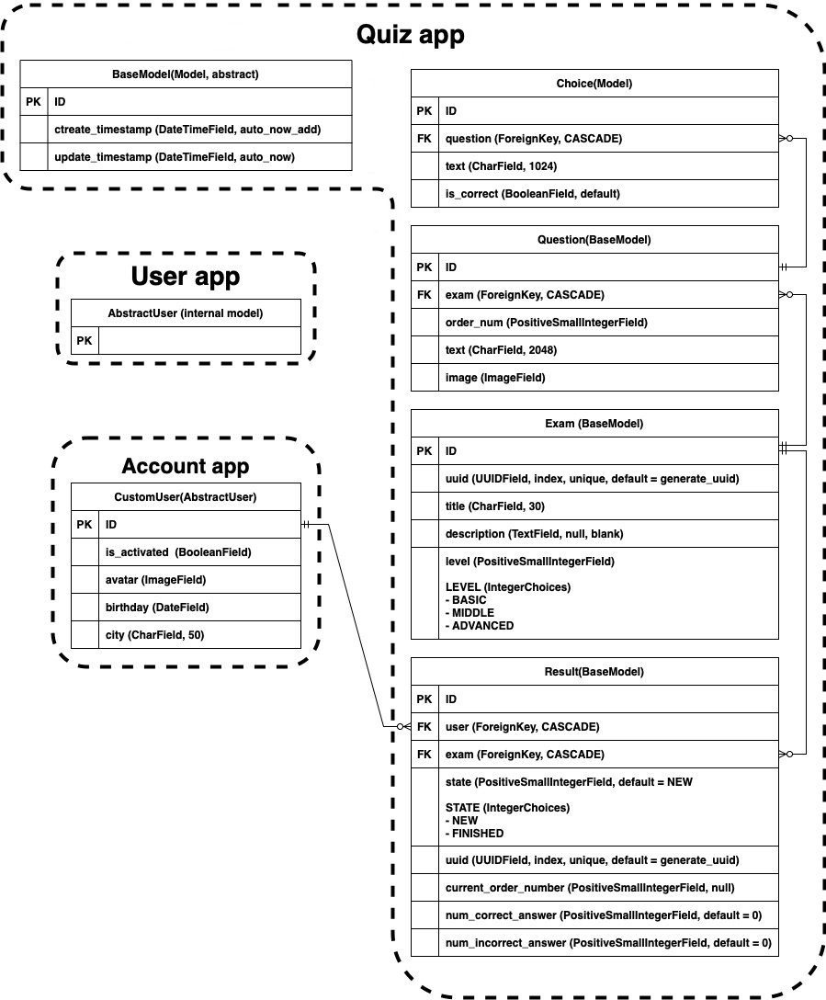

# Django QUIZ

## Технические требования  
### Web-UI
  1. Регистрация
      - [ ] регистрация (с подтверждением по email)
      - [ ] авторизация
      - [ ] смена пароля
      - [ ] сброс пароля
    
  2. Возможности пользователя
      - [ ] прохождение любого теста
      - [ ] последовательно проходить вопросы теста (один за другим)
      - [ ] завершение отложенного теста
      - [ ] удаление незавершенного теста 
      - [ ] просмотр результатов
    
  3. После завершения теста
      - [ ] отчет о ко-ве правильных и неправильных ответов
      - [ ] процент правильных ответов

### Admin site
  1. [ ] Управление пользователями
  2. [ ] Управление тестами
      - [ ] добавление теста
      - [ ] изменить тест
      - [ ] удаление теста
      - [ ] валидация теста
        - [ ] нельзя сохранить вопрос:
            - [ ] без указания правильного ответа
            - [ ] в которых все ответы правильные
        - [ ] нельзя сохранить тест если:
            - [ ] некорректный order_num (должен быть от 1 до 100 и увеличиваться на 1)
            - [ ] максимальное значение order_num не более максимально допустимого кол-ва вопросов
            - [ ] кол-во вопросов менее 3 или более 100

### Дополнительные требования
1. [ ] Проект должен быть на Git-е
2. [ ] Наличие файла requirements.txt
3. [ ] venv
4. [ ] PostgreSQL
5. [ ] Наличие дампа данных
6. [ ] bootstrap
7. [ ] Unit Tests
8. [ ] Docker image
9. [ ] Деплой на Amazon
10. [ ] Планировщик
11. [ ] Кэширование

ext.: [ ] API + Tests

## DB - Schema

